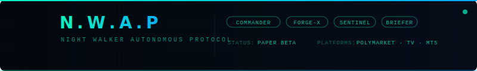

<div align="center">



**Multi-Agent AI Trading Infrastructure**

*Polymarket · Kalshi · TradingView · MT4/MT5*

---


</div>

---

## Overview

N.W.A.P is a multi-agent system for building, validating, and operating algorithmic trading infrastructure across prediction markets and financial platforms. The system runs under a structured authority chain — COMMANDER orchestrates, NEXUS executes — with strict repo-truth governance and safety gates at every tier.

**Active project:** `projects/polymarket/polyquantbot` — CrusaderBot on Polymarket.

---

## Authority Chain

```
Mr. Walker  →  COMMANDER  →  NEXUS (FORGE-X / SENTINEL / BRIEFER)
```

| Role | Function |
|---|---|
| **Mr. Walker** | Owner. Final authority on scope, risk, and capital decisions. |
| **COMMANDER** | Architect and gatekeeper. Reads repo truth, routes tasks, reviews and merges PRs. |
| **FORGE-X** | Builder. Implements, patches, refactors, opens PRs. |
| **SENTINEL** | Validator. Audits MAJOR changes before merge. |
| **BRIEFER** | Reporter. Produces HTML reports and communication artifacts from validated data. |

---

## Repo Structure

```
walker-ai-team/
├── AGENTS.md                           ← highest authority — global rules
├── PROJECT_REGISTRY.md                 ← active project registry
├── docs/
│   ├── COMMANDER.md                    ← COMMANDER operating reference
│   ├── CLAUDE.md                       ← Claude Code agent rules
│   ├── KNOWLEDGE_BASE.md               ← architecture, infra, API reference
│   ├── workflow_and_execution_model.md ← operational protocol
│   ├── blueprint/                      ← target architecture guidance
│   └── templates/                      ← state, roadmap, and report templates
├── lib/                                ← shared libraries across projects
└── projects/
    ├── polymarket/
    │   └── polyquantbot/               ← PROJECT_ROOT (active)
    │       ├── state/
    │       │   ├── PROJECT_STATE.md    ← operational truth
    │       │   ├── ROADMAP.md          ← milestone truth
    │       │   ├── WORKTODO.md         ← task tracking
    │       │   └── CHANGELOG.md        ← lane closure history
    │       ├── core/ · data/ · strategy/ · intelligence/
    │       ├── risk/ · execution/ · monitoring/
    │       ├── api/ · infra/ · backtest/
    │       └── reports/
    │           ├── forge/              ← FORGE-X build reports
    │           ├── sentinel/           ← SENTINEL validation reports
    │           ├── briefer/            ← BRIEFER communication artifacts
    │           └── archive/            ← reports older than 7 days
    ├── tradingview/
    │   ├── indicators/
    │   └── strategies/
    └── mt5/
        ├── ea/
        └── indicators/
```

---

## Source of Truth — Priority Order

| # | File | Role |
|---|---|---|
| 1 | `AGENTS.md` | Highest authority — overrides everything |
| 2 | `PROJECT_REGISTRY.md` | Active project navigation |
| 3 | `{PROJECT_ROOT}/state/PROJECT_STATE.md` | Current operational state |
| 4 | `{PROJECT_ROOT}/state/ROADMAP.md` | Phase and milestone truth |
| 5 | `{PROJECT_ROOT}/state/WORKTODO.md` | Granular task tracking |
| 6 | `reports/forge/`, `reports/sentinel/` | Build and validation evidence |

When sources conflict: `AGENTS.md` wins. Code truth wins over report wording.

---

## Validation Tiers

| Tier | Scope | Gate |
|---|---|---|
| **MINOR** | Wording, docs, templates, non-runtime cleanup | COMMANDER review |
| **STANDARD** | User-facing runtime behavior outside trading core | COMMANDER review |
| **MAJOR** | Execution, risk, capital, async core, pipeline, live-trading | SENTINEL required before merge |

---

## Branch Naming

```
nwap/{feature}
```

Short hyphen-separated slug. No dots, underscores, or date suffixes.

```
nwap/wallet-state-read-boundary   ✓
nwap/risk-drawdown-circuit        ✓
nwap/implement_wallet_state       ✗  (underscores)
nwap/phase6.5.3-fix-2026-04-16   ✗  (dots, date)
```

---

## Risk Constants

These values are fixed. No code or report may deviate.

| Rule | Value |
|---|---|
| Kelly fraction (α) | `0.25` — fractional only; `1.0` is forbidden |
| Max position size | `≤ 10%` of total capital |
| Max concurrent trades | `5` |
| Daily loss limit | `−$2,000` hard stop |
| Max drawdown | `> 8%` → system halt |
| Liquidity minimum | `$10,000` orderbook depth |
| Signal deduplication | Mandatory |
| Kill switch | Mandatory and testable |

---

## Key References

| Document | Purpose |
|---|---|
| [`AGENTS.md`](AGENTS.md) | Master rules — read before every task |
| [`docs/workflow_and_execution_model.md`](docs/workflow_and_execution_model.md) | Full operational protocol and execution model |
| [`docs/KNOWLEDGE_BASE.md`](docs/KNOWLEDGE_BASE.md) | Architecture, infra, API, and conventions |
| [`PROJECT_REGISTRY.md`](PROJECT_REGISTRY.md) | Active project list |

---

<div align="center">

*N.W.A.P — Night Walker Autonomous Protocol · Bayue Walker · Private Repository*

</div>
